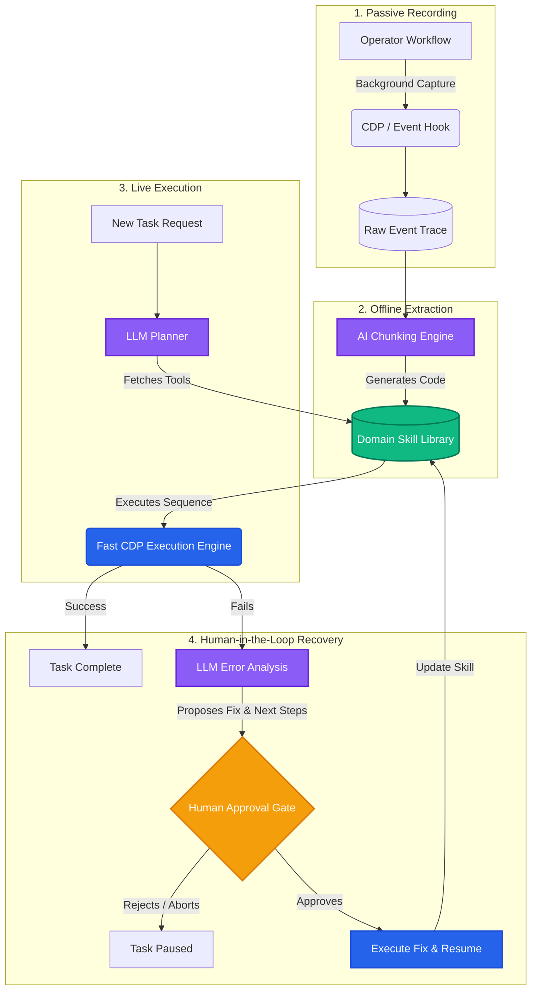

# The Enterprise Domain-Skill Platform

We are moving away from fragile "record-and-replay" macros and slow, expensive visual AI agents. Instead, we are building an **Enterprise Domain-Skill Platform**. 

The system learns by watching human operators, uses an LLM **offline** to turn those actions into reusable code modules (skills), and uses an LLM **online** only as a high-level manager to sequence those skills. If something breaks, the system halts and consults a human before making any modifications.

### Why This Approach Wins:
*   **Speed:** Tasks execute at machine speed via raw code, rather than waiting for an AI to visually scan the screen before every click.
*   **Cost Efficiency:** We avoid paying high LLM token costs for every step; the AI is only used for high-level planning and error diagnosis.
*   **Safety & Governance:** The system can suggest fixes when the portal updates, but a human must explicitly approve any changes before code is executed or updated.

---

## Architecture Diagram

---

## The 4 Phases of the Platform

### 1. Passive Recording (Data Capture)
*   **What happens:** The human operator does their normal curation job. 
*   **How it works:** A background service secretly records the underlying code and network requests (DOM, Accessibility labels, API calls) via the browser's DevTools protocol. It captures *why* the operator did something, not just where they clicked.

### 2. Offline Extraction (The Brain)
*   **What happens:** We turn messy human recordings into clean, parameterized code.
*   **How it works:** An offline AI processes the raw recording, groups the clicks into logical tasks, and generates reusable code blocks. For example, "Click India, Wait 2 seconds, Click 2026" becomes a dynamic tool: `select_country_and_year(country, year)`. These tools are stored in a central **Skill Library**.

### 3. Live Execution (The Muscle)
*   **What happens:** A new curation task is triggered (e.g., a batch of 50 new video assets).
*   **How it works:** A high-level AI Planner looks at the task, grabs the necessary tools from the Skill Library, and executes them in sequence. Because the engine runs pre-compiled code rather than generating actions on the fly, it finishes a multi-hour human workflow in minutes.

### 4. Human-in-the-Loop Recovery (The Safety Net)
*   **What happens:** The OTT portal pushes an update, and a button moves or changes its ID, causing the execution to fail.
*   **How it works:** The system immediately halts execution. An LLM analyzes the failure, formulates a plain-English problem description (e.g., *"The 'Submit to QC' button has moved inside a new dropdown modal"*), and proposes a specific code fix. This is surfaced to a human operator alongside a screenshot. If the operator hits "Approve," the system applies the fix, resumes the task, and permanently patches the Skill Library for next time.
